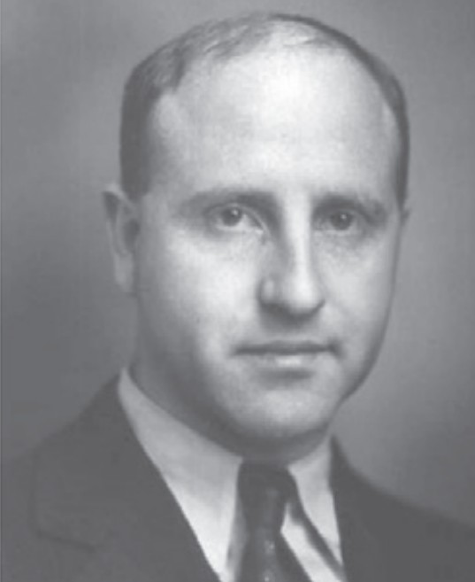
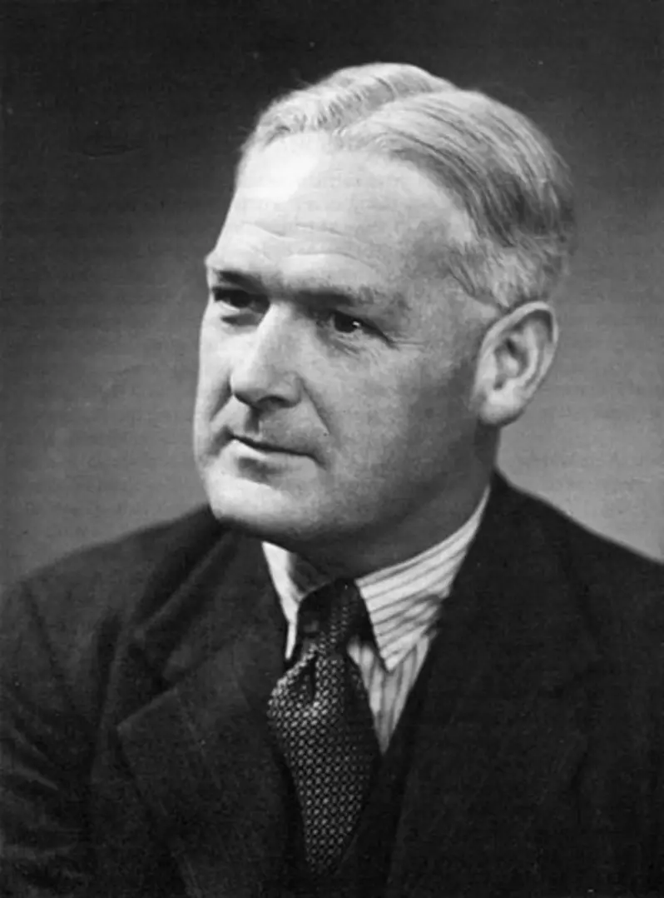
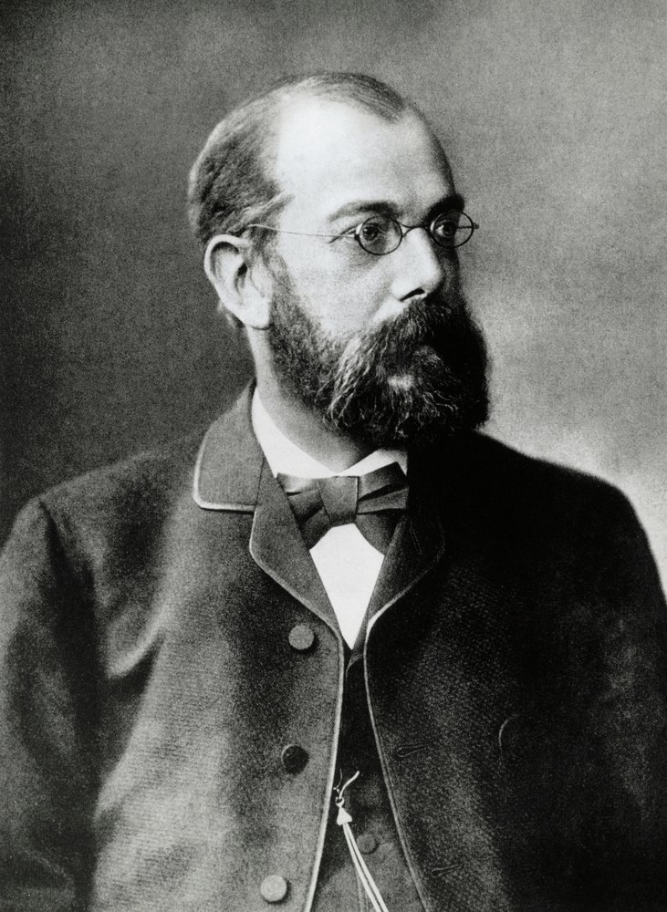

# A

# B

BERKSON
-------

***Joseph Berkson*** (1899-1982) - American physicist, physician and statistician.

### Berkson error model: 

Measurement random error model arising when a single surrogate value (e.g., a group mean) is assigned to all individuals in a category, such that true individual values fluctuate randomly around this fixed observed value.

### Berkson paradox (collider bias):

Endogenous selection bias occurring in a hospital-based study where conditioning on the common effect of hospitalization (the collider) for two or more independent conditions induces a spurious negative association between them within the study sample that is absent in the general population.

# C

# D

# E

# F

# G

# H

HILL
----

***Austin Bradford Hill*** (1897-1991) - English epidemiologist and medical statistician.

### Hill criteria:

Set of nine qualitative principles (strength, consistency, specificity, temporality, biological gradient, plausibility, coherence, experiment, and analogy) employed to assess the likelihood of a causal relationship between a potential exposure and a health outcome.

# I

# J

# K

KOCH
----

***Heinrich Hermann Robert Koch*** (1843-1910) - German physician and bacteriologist.

### Koch postulates:

Four-stage experimental protocol requiring (1) microbial presence in all diseased hosts, (2) isolation in pure culture, (3) reproduction of disease in a healthy host, and (4) re-isolation of the identical agent - to establish a specific pathogen as the causative source of a disease.

# L

# M

# N

# O

# P

# Q

# R

# S

# T

# U

# V

# W

# X

# Y

# Z